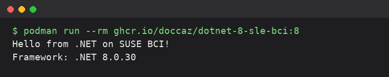

# dotnet-8-sle-bci

[](https://github.com/doccaz/dotnet-8-sle-bci/actions/workflows/build.yml)
[](LICENSE)

A minimal .NET 8 console app built and run on SUSE's **SLE BCI .NET runtime**
base image (`registry.suse.com/bci/dotnet-runtime`).

## What this is

A multi-stage image: the app is compiled with SUSE's `dotnet-sdk` BCI image,
then the published output is copied into the slim `dotnet-runtime` BCI image
for the final stage — no SDK tooling ships in the final image.

- Runs as the non-root `app` user baked into the base image (uid/gid `1654`)
- Sample app: prints a greeting and the running .NET framework version, then
  exits (this is a console app, not a long-running service)

## Supported version

[`versions.json`](versions.json) is the source of truth, recording the
tested SDK/runtime tag pairing:

| .NET | SDK tag | Runtime tag | Image tags |
|---|---|---|---|
| 8.0.30 | 8.0 | 8.0 | `8.0.30`, `8.0`, `8`, `latest` |

The SDK and runtime tags must share the same .NET major — publishing a
`net8.0` app with an 8.x SDK (or running it on an 8.x runtime) doesn't work.
`versions.json` pins the base-image tags and the tested patch; the app's
`TargetFramework` is hardcoded to `net8.0` in [`app/HelloWorld.csproj`](app/HelloWorld.csproj)
since this repo only ever targets .NET 8.

## Layout

```
Dockerfile              # multi-stage build (SDK_TAG, RUNTIME_TAG build args)
versions.json           # source of truth: tested SDK/runtime tag pairing
app/
  HelloWorld.csproj
  Program.cs
screenshots/            # for this README
```

## Pulling the pre-built image

Every push to `main` builds and publishes the image to GitHub Container
Registry via [`.github/workflows/build.yml`](.github/workflows/build.yml):

```bash
podman pull ghcr.io/doccaz/dotnet-8-sle-bci:8        # floating major tag
podman pull ghcr.io/doccaz/dotnet-8-sle-bci:8.0.30   # exact pinned version
```

## Building locally

```bash
podman build \
  --build-arg SDK_TAG=8.0 \
  --build-arg RUNTIME_TAG=8.0 \
  -t dotnet-8-sle-bci:test .
```

Omitting the build args falls back to the Dockerfile defaults (`8.0`/`8.0`).
NuGet restore happens during the build stage, so it needs network access.

## Running

```bash
podman run --rm ghcr.io/doccaz/dotnet-8-sle-bci:8
```

Expected output:
```
Hello from .NET on SUSE BCI!
Framework: .NET 8.0.x
```



The container exits immediately afterwards (exit code 0) — this is a
console app, not a service, so don't run it with `-d`.

To confirm it's running as the non-root `app` user:
```bash
podman run --rm --entrypoint id ghcr.io/doccaz/dotnet-8-sle-bci:8
```

## Updating

### Bumping the .NET patch version

1. Confirm the new patch tag exists: `skopeo list-tags docker://registry.suse.com/bci/dotnet-sdk` (and `dotnet-runtime`).
2. Update `dotnet_version` in `versions.json` to the new exact patch.
3. Rebuild and smoke-test locally (see "Running" above) before pushing.

### Replacing the sample app

Edit `app/Program.cs`/`app/HelloWorld.csproj` (or add more files under
`app/`) and rebuild — the Dockerfile's build stage runs `dotnet publish`
against `HelloWorld.csproj` and copies the output into the final image.

### Rebasing on a newer SLE BCI point release

SUSE periodically republishes each `dotnet-sdk`/`dotnet-runtime:8.0` tag
against newer patches. The next CI run on `main` rebuilds against the
current point release automatically. To force a local rebuild:

```bash
podman pull registry.suse.com/bci/dotnet-sdk:8.0
podman pull registry.suse.com/bci/dotnet-runtime:8.0
podman build --pull --build-arg SDK_TAG=8.0 --build-arg RUNTIME_TAG=8.0 \
  -t dotnet-8-sle-bci:test .
```

## Verified

- Builds cleanly with `SDK_TAG=8.0`/`RUNTIME_TAG=8.0`
- Runs as uid/gid `1654` (`app`), not root
- Prints the expected greeting and framework version, exits 0

## CI/CD

[`.github/workflows/build.yml`](.github/workflows/build.yml) reads
`versions.json`, then builds and pushes the image to
`ghcr.io/doccaz/dotnet-8-sle-bci` on every push to `main` and on manual
dispatch; pull requests build but don't push. The workflow uses the repo's
own `GITHUB_TOKEN`, so no extra secrets are needed.

The published package inherits this repository's visibility, so it's
pullable anonymously — no `podman login`/`docker login` needed. If that
ever changes, visibility can be set explicitly from the package's GitHub
settings page
(`github.com/doccaz/dotnet-8-sle-bci/pkgs/container/dotnet-8-sle-bci` →
**Package settings** → **Change visibility**).

## License

Licensed under the [GNU General Public License v3.0](LICENSE).
